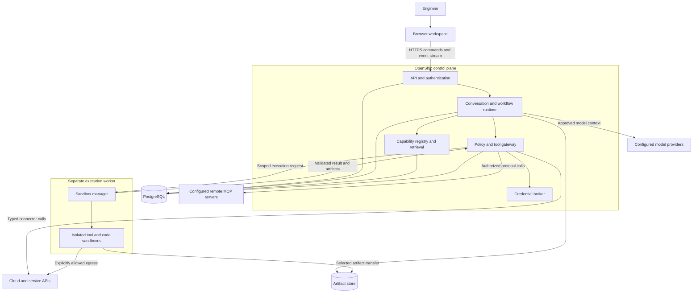
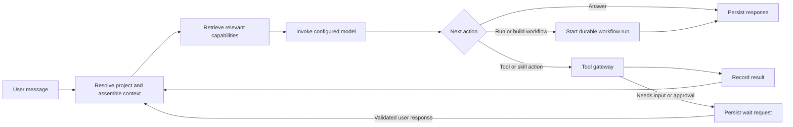

# OpenShip Harness Architecture

OpenShip is a self-hosted DevOps co-pilot accessed through a browser. An engineer describes an outcome in conversation; the harness discovers relevant capabilities, performs authorized work, and makes its progress, artifacts, and decisions visible. Reusable workflows extend that conversation with a durable, inspectable process.

The proposed architecture is a **modular application with a separate execution worker**. Python and LangGraph provide the agent and workflow runtime; a TypeScript web application provides the conversational workspace. Persistent state, capability discovery, authorization, and sandboxing belong to the harness rather than to the model.

This document redesigns the previous resource-focused architecture using [the project ideas](./ideas.md), the [agent PoC](../apps/agent/src/cli.py), and the six current requirements. Those requirements define the requested scope. Technology choices and changes to earlier ideas below are proposals for review, not implementation commitments. The existing PoC remains an experiment; this document describes the target service.

## 1. Requirements and Design Principles

| Requirement | Architectural response |
| --- | --- |
| Self-hosted on EC2, a remote server, or localhost; browser access | One service distribution with local and remote deployment profiles; independently deployable execution workers. |
| Natural conversation with frontier models, skills, tools, and MCP | Provider adapters, a general conversational agent loop, and a common capability gateway. |
| Create workflows from freeform descriptions | A workflow-builder graph turns conversation or Markdown into a validated, versioned specification. |
| Integrate workflows into chat and show progress and input/output | Conversations reference durable runs; structured events drive workflow cards, diagrams, step inspectors, and input forms. |
| Modular community extensions and semantic discovery | A local capability registry indexes tools, skills, and workflows, with access filtering and progressive loading. |
| Secure isolation and ephemeral generated code from day one | A separate sandbox manager, enforced execution profiles, scoped credentials, network controls, and server-side authorization. |

Engineers remain in control. The agent acts naturally within previously granted authority; operations outside that authority require a concrete review or additional configuration. A model recommendation, retrieved skill, or workflow definition never grants permission by itself.

The initial product serves one self-hosted installation with multiple projects and, when configured, multiple users. It does not depend on an OpenShip-hosted control plane, public marketplace, or hosted LangGraph service. External model providers and connected services are explicit integration choices.

## 2. Reconciliation with Existing Ideas

The design preserves projects, document-driven infrastructure workflows, resource identity, community contributions, and the principle that workflow building is itself agentic. It resolves several tensions in the existing document:

| Existing idea | Proposed interpretation or revision |
| --- | --- |
| Documents are the primary entry point; other sections make chat primary | Conversation is the product entry point. Requirements documents remain first-class inputs and artifacts within infrastructure workflows. |
| Everything is a workflow | All agent activity uses the same durable graph runtime. An ordinary chat turn needs no saved template; reusable workflows are named, versioned graphs within that runtime. |
| The agent knows all registered capabilities | The registry knows the inventory. Each model invocation receives only relevant, authorized descriptions and schemas. |
| Sessions and resource mappings persist in Git | The database persists live runtime state and mappings. Git versions selected requirements, workflow definitions, desired resource specifications, and generated code. |
| Agent permissions equal the engineer's permissions | The engineer delegates a subset of their authority, scoped to project, environment, connector, action, and duration. |
| Imported workflows may proceed after a warning | Imports remain inspectable, but execution must satisfy schema, authorization, dependency, and sandbox requirements. A warning cannot bypass a hard security boundary. |
| Every sandbox receives Vault secrets and a shared volume | Sandboxes receive selected artifacts and capabilities. Generated code starts without secrets; workspaces are isolated per run and published artifacts persist separately. |
| Registry lives in the repository | Community source remains reviewed and release-versioned in the repository. Each installation maintains a local runtime index with separate private and imported namespaces. |

These revisions are explicit proposals; the ideas document remains the historical source of product intent.

## 3. System Boundaries

The control plane owns identity, conversations, scheduling, policy, and durable state. The execution plane runs executable extensions, local MCP servers, CLI tools, and generated code. A worker receives a bounded execution request, not database credentials or unrestricted control-plane access. Maintained typed connectors may execute in the trusted gateway; their network requests and credential use are still scoped and audited. Remote MCP servers are an external trust boundary, not protected by the local sandbox.

The initial control plane is a modular monolith: API, registry, runtime, and policy modules share one codebase and database. API and runtime workers can run as separate processes from the same distribution. Sandboxed execution is a separate process and trust boundary even on one machine. Modules can later move into independent services without changing their contracts.

| Component | Responsibility |
| --- | --- |
| Web workspace | Conversation, workflow graph/timeline, inputs, approvals, artifact inspection, project navigation. |
| API | Authentication, project authorization, command validation, uploads, event delivery, administrative configuration. |
| Agent runtime | Model loop, context assembly, capability selection, task routing, conversation checkpoints. |
| Workflow runtime | Graph compilation, scheduling, durable waits, child runs, budgets, recovery. Uses the same LangGraph foundation as the agent runtime. |
| Capability registry | Versioned metadata/packages, lexical and semantic discovery, dependency/compatibility resolution. |
| Tool gateway | Sole admission path for capability execution; validates arguments, checks policy, records operations, routes execution. |
| Credential broker | Resolves connector references into scoped credentials or authenticated connector calls. |
| Sandbox manager | Creates, supervises, terminates, and cleans up isolated execution environments. |
| State and artifact stores | Application state, checkpoints, event journal, operation records, versioned artifacts. |

## 4. Self-Hosted Deployment

Ship a container-based distribution with configuration and health checks for the API, runtime worker, PostgreSQL, artifact storage, and sandbox worker. Docker Compose is the proposed first packaging target. Kubernetes is a later option, not a prerequisite.

| Profile | Arrangement | Access and isolation |
| --- | --- | --- |
| Local workstation | Control plane and database run locally; sandbox worker runs on Linux or in a dedicated Linux VM. | Bind web access to loopback by default; provision an authenticated local session. Never expose the user's home directory to execution. |
| EC2 or remote Linux server | One host can run the distribution; execution uses a separate worker process with the required sandbox runtime. | TLS and authentication for browser access; restrict ingress through a private network, VPN, or configured reverse proxy. Block sandbox access to instance metadata. |
| Team deployment | API/runtime, database, storage, and execution workers can be separated across hosts. | Project membership, connector policies, worker authentication, private internal endpoints, independently scalable execution. |

On macOS or Windows, use a dedicated Linux VM or a remote Linux worker for untrusted execution. The installer checks sandbox support before enabling executable capabilities. A machine lacking that support can still serve chat and workflow authoring; execution requests remain blocked until a compatible worker is available. There is no automatic fallback to host subprocess execution.

The sandbox manager may need a container-runtime or VM interface. That access belongs only to its restricted worker host; neither the API, model runtime, nor any sandbox receives a Docker socket or equivalent administrative interface. Authenticate control-plane-to-worker requests, constrain the worker protocol, and reject expired or altered execution requests.

Maintain coordinated backup/restore procedures for the database, artifacts, configuration, and separately protected credential encryption keys. Restoring a backup enters reconciliation mode before resuming pending external mutations. Upgrades drain or checkpoint runs and preserve compatible runtime/package versions for resume.

Self-hosting keeps the harness and its stored state in the user's infrastructure. Context sent to a remote LLM, embedding provider, or MCP server leaves that boundary. Configuration makes these destinations visible and supports local embeddings and compatible local model endpoints where required.

## 5. Core Domain Model

| Entity | Purpose and relationships |
| --- | --- |
| Project | Scope for membership, environments, connectors, conversations, workflows, resources, artifacts. |
| Conversation | Persistent messages and references to runs/artifacts. A conversation can start several runs; authorized views can link to the same run. |
| Capability package | Versioned tool, skill, or workflow with provenance, compatibility, dependencies, declared requirements. |
| Workflow definition | Immutable executable specification revision, human-readable source, dependency lockfile. |
| Run | Execution of an agent turn or workflow revision; records initiator, project, inputs, model configuration, budgets, state, optional parent run. |
| Step execution | Logical node invocation, including loop/branch identity, attempts, input/output references, status. |
| Operation | Durable tool-operation record with stable ID, arguments digest, authorization, dispatch state, reconciliation outcome. |
| Input request / approval | Pending decision bound to run, step, revision, scope, and eligible actor. |
| Artifact | Immutable document, diagram, code, report, or log version with access policy and provenance. |
| Connector binding | Project/environment reference to an external account, endpoint, and credential policy; stores references rather than raw secrets. |
| Resource object / binding | Desired abstract resource and mappings to concrete provider resources, with observation history. |

Conversation IDs, run IDs, workflow-definition IDs, and LangGraph thread IDs are distinct. Persist their relationships explicitly. Each workflow run receives a stable graph thread identity; checkpoints are not overloaded as the entire application data model.

Every execution has a project context. If a home-page request has none, resolve or create a personal project before invoking tools. Resolve phrases such as "that deployment" from scoped resource and artifact references; ambiguous targets require clarification.

## 6. Conversation Harness and Model Compatibility

The conversational agent is a durable graph with a bounded model/tool loop:

The agent can answer a question, perform an authorized tool call, activate a skill, start an existing workflow, or invoke the workflow builder. A saved template supports repeatability rather than being a prerequisite for helping the user. If no template matches, continue as a general task run and optionally save a reusable process after the work is understood.

### Provider adapter contract

Normalize messages, tool-call requests/results, streaming output, cancellation, usage accounting, and errors behind an adapter interface. Advertise structured-output support, context limits, attachments, and parallel tool calls. Validate model-produced structures server-side regardless of provider features.

Proposed initial targets are OpenAI, Anthropic, and Google frontier-model APIs, plus configurable OpenAI-compatible endpoints. Select concrete supported models through configuration and adapter conformance checks rather than embedding names throughout the runtime. An OpenAI-compatible endpoint is one integration path; it does not establish compatibility with every provider.

Skills and orchestration are harness functions. MCP tools are normalized into the common tool schema and passed through adapters; models do not need native MCP transport support. Provider-specific functionality stays inside its adapter.

Pin model/provider configuration per run and record any authorized fallback. Apply bounded retries to rate limits/transient failures; model changes cannot alter execution authority. Enforce token, time, tool-call, and cost budgets.

### Context assembly

Load project policy and a small fixed set of harness capabilities first. Add recent conversation, a durable summary, referenced artifacts/resources, active workflow state, and selected capability schemas. Large files/logs stay in artifact storage and are read in bounded portions.

Refresh capability selection as the task moves between stages. Evict irrelevant descriptions under a token budget while retaining references/provenance of used capabilities. Context reduction cannot remove server-side policy.

## 7. Modular Capabilities and the Registry

### Capability types

| Type | Contract | Execution meaning |
| --- | --- | --- |
| Tool | Typed input/output schemas and implementation reference. | A bounded operation invoked through the gateway. |
| Skill | `SKILL.md`, metadata, optional references, scripts, assets. | Instructions loaded when relevant; scripts run through sandbox capabilities. |
| Workflow | Human-readable source, validated graph specification, lockfile. | A reusable process with typed inputs, outputs, steps, and waits. |
| Connector | Authentication/account/endpoint configuration and credential policy. | Supplies access to tools; does not itself grant unrestricted authority. |

Use the [Agent Skills format](https://agentskills.io/specification) for portable packaging and on-demand instruction/reference loading. OpenShip adds registry and policy metadata around the package; an imported skill's `allowed-tools` declaration remains a request, not an authorization grant.

### Package and tool contract

Packages declare namespace, stable ID, version, content digest, summary, tags, compatibility range, dependencies, provenance, and license. Tool manifests also declare input/output schemas, execution kind, image/entrypoint, required connectors, permissions, network destinations, resource limits, side-effect classification, and retry/idempotency behavior.

Execution kinds are maintained connector adapters, sandboxed executable packages, and MCP tools. Python/TypeScript contributors can provide a packaged executable or OCI image without editing the agent loop. Third-party executables are not imported into the trusted API/runtime process.

Manifests request limits; administrator policy sets maximum effective limits. A tool calling itself "read-only" does not establish that fact; allowed backend operations, credential scope, and network policy must support its classification.

A contribution includes manifest, implementation/package, schemas, examples, compatibility information, and contract tests. Repository contributions pass review/scanning and ship in a versioned catalog. Private packages occupy installation/project namespaces. Imports occupy an unverified namespace until enabled; they do not gain curated-catalog trust status.

### Discovery and progressive loading

1. Ingest configured catalogs, installed packages, private definitions, and approved MCP metadata. Build lexical/semantic indexes over descriptions, schemas, tags, and examples.
2. Filter candidates by user/project access, installation policy, package trust, compatibility, and supported execution profile **before returning discovery results**. Check connector readiness separately so a permitted capability can explain a missing connection.
3. Combine semantic ranking with exact names and keyword search. Explicit workflow dependencies and user references resolve by stable ID rather than similarity alone.
4. Return a small metadata result set. Load full tool schemas, skill instructions, or workflow details only after selection, within a context budget.
5. Re-check authorization and selected content digest at execution. Discovery/context loading do not authorize installation or invocation.

Use a configurable local embedding model by default; track its version and rebuild the index on changes. Lexical discovery remains available if embeddings fail. Registry descriptions/examples are access-controlled data; search cannot expose private projects or send their text to an unconfigured embedding provider.

Do not install packages automatically because search finds them. Missing dependencies produce a blocked capability and an explicit installation/configuration action. Catalog updates do not mutate packages pinned by active runs.

### MCP integration

Local stdio MCP servers run in sandboxes. Remote HTTP MCP servers are registered endpoints with explicit network/credential policies. Normalize their tools, resource references, prompts, and results into harness contracts; server-provided prompts/resources remain external content.

Namespace tool IDs by the installation's server binding to prevent collisions. Snapshot discovered schemas/digests for a workflow revision and revalidate changes before further calls. If a remote server cannot guarantee implementation versioning, record that limitation: a schema digest does not guarantee code integrity. The [MCP tool specification](https://modelcontextprotocol.io/specification/latest/server/tools) defines schemas and treats annotations from untrusted servers as untrusted.

Apply endpoint allowlists, OAuth audience separation, redirect validation, and SSRF protections during connection/authentication discovery. Private endpoints can be explicitly configured; arbitrary URLs cannot inherit their access. These address risks documented in [MCP security best practices](https://modelcontextprotocol.io/specification/latest/basic/security_best_practices).

## 8. Freeform Workflow Creation and Compilation

Workflow building is a built-in agentic graph exposed through chat, a workflow-builder view, and eventually the API used by CLI clients:

1. **Capture intent:** Accept a freeform message, Markdown file, existing workflow, or conversation selection. Clarify missing targets, inputs, success criteria, and constraints.
2. **Discover capabilities:** Retrieve suitable tools, skills, and reusable workflows. Identify missing connectors or unsupported operations without inventing tool IDs.
3. **Draft a specification:** Produce a typed intermediate representation with explicit inputs, outputs, dependencies, control flow, and policy requirements.
4. **Validate:** Check schemas, data references, compatible versions, permissions, execution profiles, loop bounds, retries, timeouts, and reachable terminal states. Return actionable conversation feedback.
5. **Review:** Show the human-readable process, graph, input/output contracts, and required authority. Allow edits/refinement through conversation.
6. **Save a revision:** Persist source, specification, digest, lockfile, and review history. Saving/reviewing a workflow does not authorize its external mutations.
7. **Compile and run:** Bind the specification to maintained LangGraph node factories, check current inputs/policy, and create a durable run.

The intermediate representation supports tool calls, bounded agent steps, input/approval waits, conditions, bounded loops, parallel branches, child workflows, artifact generation, and terminal results. Conditions/bindings use a restricted typed expression format, never Python `eval` or arbitrary shell templates. Authors compose these node types without changing runtime code.

An agent step may discover tools or generate code during execution, but every resulting call passes through the gateway. New permissions or changes to reviewed side effects produce a revised action and appropriate gate. Dynamic behavior remains bounded by run authority and budget.

Markdown is the human-readable source; the validated specification is the executable definition for a revision. Changing either creates a new revision and requires reconciliation between them. The UI renders that specification rather than independently inferring another execution plan from prose.

A compilation cache key includes specification digest, locked dependency digests, schema/compiler version, runtime compatibility, and execution-profile definitions. Cache hits accelerate graph construction and never bypass current policy/connector checks. Store validated data and reconstruct graphs from maintained factories, avoiding executable pickle caches or model-generated orchestration code.

Checksums detect content changes; they do not prove publisher authenticity or prevent replacement of both a package and its hash. Trust comes from controlled installation, authenticated provenance/signatures where available, access controls, and runtime enforcement.

## 9. Durable Runtime and Recovery

Use LangGraph checkpoints/interrupts with a persistent PostgreSQL checkpointer and stable graph identities. Input/approval waits persist their request and checkpoint and release execution resources; they need no browser connection or live sandbox. [LangGraph interrupts](https://docs.langchain.com/oss/python/langgraph/interrupts) support pause/resume and can re-enter an interrupted node, so separate approval nodes from external side effects.

### Scheduling and consistency

The service needs a scheduler around the graph library. Initially use a PostgreSQL-backed queue, worker leases, heartbeats, and fenced run ownership. Allow one writer per run; parallel steps have distinct identities. Child runs inherit the parent's project and no broader permissions, with nesting/concurrency limits.

In one application transaction, persist a validated command/state transition and its outbox event. Deliver events and queue work from that outbox with deduplication. Graph checkpoints, application projections, and external operations are related but separate records; a cloud mutation is not atomic with a checkpoint write.

Before an external operation, persist its intent and stable operation key derived from the run and logical step invocation. Retries reuse that key; loop iterations and new requested operations receive distinct keys. Dispatch requires current run ownership, authorization, and any bound approval. Persist the result before advancing application status; a reconciler resolves crashes between these writes and the next checkpoint.

Use provider idempotency keys where supported. For uncertain results, query the provider or inspect known resource IDs before retrying. If the outcome cannot be established safely, pause for reconciliation. Neither checkpoints nor the journal guarantee exactly-once effects against an arbitrary external API. This follows the replay/idempotency constraints in [LangGraph's functional API](https://docs.langchain.com/oss/python/langgraph/functional-api).

Serialize conflicting mutations against the same environment, Terraform backend, or resource scope. Honor Terraform backend locking; an OpenShip lease does not prevent changes made by other systems.

### Lifecycle and failure handling

Runs use `queued`, `running`, `waiting_input`, `waiting_approval`, `waiting_connector`, `paused`, `reconciling`, `cancelling`, and terminal `succeeded`, `failed`, or `cancelled` states. Track step status and external operation outcome separately. Resume is an authenticated command that re-checks revision, policy, connector scope, and pending-request identity.

| Condition | Behavior |
| --- | --- |
| Browser disconnect | Run continues or remains durably waiting; reconnect reconstructs current state. |
| Worker crash / lease loss | Stop new dispatches, revoke short-lived grants, reconcile outstanding operations, resume under a new owner. |
| Model outage / rate limit | Bounded retries; pause/fail when the budget is exhausted. |
| Connector missing / expired | Enter `waiting_connector`; allow authorized setup without losing progress. |
| Timeout after possible mutation | Mark outcome uncertain; reconcile before any repeat attempt. |
| Partial infrastructure failure | Report completed/uncertain actions and artifacts; propose recovery/compensation without implying universal rollback. |
| Cancellation | Stop admitting steps, revoke grants, terminate sandboxes, reconcile dispatched operations. Completed changes are not undone. |
| Permission / package revoked | Deny new invocations, invalidate affected grants, expose a blocked state. |

Budgets cover steps, loops, recursion, parallelism, tokens, time, network traffic, and artifact/log volume. Retries and compensation are explicit behavior, not unlimited autonomous repair loops.

## 10. Conversation and Web UI Integration

Conversation is the stable workspace. Starting a workflow adds a run card and opens its inspector in place. Built-in workflows can have specialized panels; custom workflows receive schema-driven input forms, a graph/timeline, and artifact views. Both use the same backend contracts.

Persist semantic events such as `run.started`, `step.started`, `tool.requested`, `tool.completed`, `input.requested`, `approval.requested`, `artifact.created`, `run.paused`, and `run.completed`. Each has schema version, event ID, ordered sequence, project/conversation/run IDs, timestamp, actor, and safe payload or artifact reference.

Deliver events through authenticated Server-Sent Events; messages/decisions use HTTP commands. SSE is the initial transport because server-to-browser progress dominates. Reconnect uses an event cursor; expired history returns a current snapshot before streaming resumes. Deduplicate repeated deliveries by event ID.

Token deltas can be transient; completed messages and workflow transitions are durable. Large logs use bounded streaming and persisted artifact chunks rather than unbounded event/database payloads. Slow clients cannot block execution.

Show active step, branch/loop state, elapsed time, resolved inputs, outputs, tool status, artifacts, and pending decisions. Distinguish observed results from agent summaries. Surface concise action explanations/evidence without requiring a model's private reasoning.

An input/approval card identifies its run, step, request, and revision. A reply such as "yes" is accepted only when it unambiguously identifies a pending request and passes eligibility checks; otherwise clarify. Browser controls and conversational commands submit the same validated command. Stale/repeated submissions cannot resume another step.

Status messages read the active run state. Scope/input changes become serialized commands applied at safe boundaries. Running revisions stay immutable: edits create a new revision or deliberate fork and invalidate affected approvals. Side-effecting history cannot be replayed merely to explore a fork.

Frontend capabilities request known renderers for documents, diagrams, diffs, resource tables, and forms. They carry typed data/artifact IDs, not executable HTML/JavaScript. Sanitize Markdown/SVG and isolate previews; infrastructure credentials never reach the browser.

## 11. Sandbox Architecture

### Threat model and profiles

Treat generated code, imported scripts, third-party executables, local MCP servers, repository content, and tool responses as potentially hostile. Protect the host, control plane, credentials, other projects/runs, and unintended destinations. Contain accidental CPU, memory, disk, and process exhaustion as well.

Use an isolation-provider interface for create, execute, stream logs, transfer selected artifacts, stop, and destroy operations. The first proposed Linux provider uses OCI images with gVisor. Its userspace application kernel reduces direct host-kernel exposure; compatibility/performance must be checked against supported DevOps tools. See the [gVisor architecture documentation](https://gvisor.dev/docs/).

MicroVMs or dedicated worker VMs are later stronger-isolation options. Ordinary containers with namespace/seccomp controls alone are not the supported boundary for untrusted generated code. Select a worker satisfying the profile or refuse execution.

| Profile | Intended work | Access |
| --- | --- | --- |
| Generated-code sandbox | Ephemeral Python, JavaScript, shell, transformations, tests. | No credentials/network by default; only selected input artifacts and temporary output space. |
| Installed-tool sandbox | Reviewed executable tools and local MCP servers. | Explicit endpoint allowlist and limited capabilities; no installation-wide secrets. |
| Credentialed CLI sandbox | Terraform/platform CLIs requiring direct credentials. | Separate authorization for the executable bundle, target, credential scope, and time window; minimum feasible provider authority. |

### Enforced controls

- Run without root, drop capabilities, apply runtime syscall controls, and use a read-only base filesystem with bounded scratch space.
- Deny privileged mode, host PID/network namespaces, device passthrough, administrative sockets, control-plane mounts, and arbitrary host paths.
- Isolate workspaces per run. Materialize approved input versions and transfer artifacts through a restricted broker; never share writable workspaces across projects/runs.
- Limit CPU, memory, processes, disk, time, output size, and concurrency outside the sandbox.
- Deny network by default. Enforce destinations outside the sandbox, including DNS, IPv4/IPv6, redirects, and resolved addresses; block metadata/control-plane endpoints. Private destinations require explicit connector policy.
- Pin/scan images and dependencies. Prebuild tool profiles; do not grant unrestricted package installation/network access to construct an image during execution.
- Destroy sandboxes on completion, timeout, or cancellation. Reap abandoned instances after crashes and clean temporary data under retention policy.

Retain explicitly published artifacts and approved resumable workspace snapshots. During long waits, snapshot necessary non-secret state, destroy the sandbox, and rebuild it on resume. Snapshots are private untrusted artifacts; a live process is never the durable workflow state.

### Ephemeral code execution

Generated code becomes a versioned artifact with digest, runtime/dependencies, input references, requested capabilities, and limits. Validate these fields and bind authorization to that digest before dispatch. Static checks or LLM safety review provide feedback, while isolation and gateway policy enforce safety.

Start in the generated-code profile. For external actions, prefer a narrow broker interface admitting typed requests through the gateway. Its identity is valid only for selected operations, inputs/resources, run, and duration; the sandbox cannot convert it into generic credential/network access.

Credentialed CLI execution is a different privilege level. A process holding cloud credentials can exercise the operations those credentials allow; command review does not enforce exact API-call intent. Grant the smallest provider scope and authorize the entire executable/configuration bundle for that scope. If it is too broad, require a maintained typed connector or deny execution. Sandbox isolation cannot compensate for overpowered cloud credentials.

## 12. Authorization, Secrets, and Trust

Enforce membership/roles at every API, artifact access, event subscription, capability load, approval, and execution boundary. Suggested roles are viewer, operator, approver, and administrator; deployments can combine them while preserving explicit checks. Connector grants are separately scoped to environment and operation class.

The gateway evaluates the intersection of user authority, project policy, connector grant, workflow requirements, capability limits, approval, and sandbox profile. It returns allow, require input/approval/configuration, or deny. Skills, plans, and models only propose actions within these controls.

Preauthorized low-risk reads need no repeated prompts. Mutations, destructive actions, and external publication use configured gates. Approval records bind the operation/plan digest, resolved target/environment, inputs, package/code digests, actor, and expiry. Changes invalidate approval. Approval cannot override an unavailable sandbox, disabled package, or missing permission.

For Terraform, show a saved plan and its backend/environment, approve its digest, and apply that exact plan through the credentialed profile. Revalidate relevant state/policy before apply; a stale plan requires a new review instead of unreviewed replanning.

Manage secrets separately from workflows. Start with an encrypted instance credential store whose key is protected separately from database backups; provide a broker interface for Vault/cloud secret managers. Prefer short-lived delegated credentials. Never put raw credentials in model context, embeddings, conversation history, checkpoints, Git, or browser payloads.

Keep credentials in the broker/maintained connector when possible. If a CLI needs one, supply it only to that credentialed execution, revoke/expire it promptly, and avoid logging environment/configuration contents. Publication applies redaction, sensitivity classification, limits, and access policy. Redaction is defense in depth, not permission to expose secrets to arbitrary code.

Fetched documents, skills, MCP responses, logs, and repository instructions are data with provenance. They cannot change system policy or approve themselves. Separate trusted instructions from retrieved content and enforce policy at the gateway when prompt injection induces unauthorized requests.

Keep an append-only application audit journal of actor, model/provider, capability version, policy decision, approval, execution request, outcome, and artifact references. Restrict writes/access and offer export to an independently controlled audit sink for stronger tamper resistance. Installation administrators remain trusted operators; a local database alone cannot defeat them.

Secure browser/API access with authenticated sessions, TLS remotely, origin/CSRF controls, upload validation, and explicit connector callbacks. Authentication and policy belong in the first usable service.

## 13. State, Artifacts, and Resource Identity

### Storage responsibilities

| Store | Authoritative responsibility |
| --- | --- |
| PostgreSQL | Users/projects, conversations, revisions, run projections, requests, checkpoints, operation journal, outbox, connector references, resource bindings. |
| Registry search index | Rebuildable lexical/vector index of authorized metadata; proposed pgvector in the same database. |
| Artifact store | Immutable versions and controlled snapshots; local durable storage first, optional S3-compatible storage. |
| Git | Reviewed requirements, workflow exports, desired infrastructure specifications, generated code, selected non-secret artifacts. |
| Terraform backend / provider APIs | Managed Terraform state and live resources. Sensitive state belongs in a protected backend, not Git. |
| Secret backend | Credential material/key references, accessed through the broker. |

Retain messages, events, logs, artifacts, and checkpoints under explicit policies. Sandbox cleanup cannot silently delete durable outputs. Artifact metadata includes digest, size, type, sensitivity, originating run/step, and source relationships. Git publication is an explicit policy-controlled action, not the persistence mechanism for every execution.

### Resource identity and state

Preserve IDs such as `openship://{project_id}/{object_type}/{object_id}`. Version desired resource specifications in Git when configured. Database bindings identify environment, connector/account, provider, region, concrete IDs, owning run/step, and optional Terraform backend/workspace/address.

One abstract object can map to several concrete resources. Record ownership/management method per binding so Terraform and direct API tools do not independently manage the same resource without a deliberate handoff.

Distinguish desired configuration, management state, and live observations. Terraform state tracks identity but does not prove live state; API reads and refresh/plan operations provide timestamped observations. Mappings are locators/history, not proof that resources still exist.

For "scale the deployment created earlier," resolve its abstract ID within project/environment context, inspect bindings, refresh observations, and execute through the gateway. Update mappings/journal after confirmed results. Record uncertain outcomes rather than claiming failed calls created nothing.

Use `openship:project`, `openship:object`, and `openship:run` tags where supported, adapting to platform tag/label rules. They aid discovery/reconstruction, not authorization. IDs/observations can be sensitive and are not automatically published to Git.

Drift detection compares desired revisions against observations. Options are report, adopt observed configuration into a new desired revision, or reconcile infrastructure to the desired revision. Adoption/changes use normal review/policy gates. Reconstruct missing mappings from tags or Terraform state and confirm them with the engineer. Rewinding Git history does not undo infrastructure changes.

## 14. Proposed Technology Choices and Trade-offs

| Area | Initial choice | Reason and practical limit |
| --- | --- | --- |
| Backend | Python, FastAPI, Pydantic | Fits the PoC and gives explicit request/state contracts; extensions remain out of process. |
| Orchestration | LangGraph with PostgreSQL persistence | Extends current graphs; OpenShip still supplies scheduling, reconciliation, and isolation. |
| Web UI | Vue 3, TypeScript, Vite | Builds on [existing mockups](../mockup/README.md); reusable components render schema-driven workflows. |
| Data / initial queue | PostgreSQL | One required state service simplifies hosting; contention/recovery need integration tests. |
| Discovery | pgvector, lexical search, local embeddings | Avoids a separate vector service; indexes remain disposable and access-filtered. |
| Browser progress | SSE and HTTP commands | Reconnectable progress; add another transport if interactive sessions require it. |
| Sandbox | OCI profiles with gVisor on compatible Linux workers | First isolation provider; validate tool behavior and provide VM workers when needed. |
| Artifacts | Durable local storage interface; optional S3-compatible backend | Simple single-host setup and a path to distributed workers; access remains scoped. |
| Distribution | Container images and Compose | Fits localhost/remote servers; installer also checks/provisions execution isolation. |
| Telemetry | Structured logs/metrics, optional OpenTelemetry export | Track failures, queue delay, usage, limits, and waits without requiring hosted tracing. |

Keep one graph engine initially. Temporal, Redis, a separate vector service, Kubernetes, and an external marketplace are later choices justified by operational needs.

## 15. Example: Conversation to Reusable Workflow

An engineer asks: "Create a workflow that checks our staging deployment, collects logs when it is unhealthy, proposes a fix, waits for approval, applies it, and checks health again."

1. Resolve project, staging environment, deployment bindings, and connectors. Ask for missing success criteria.
2. Retrieve authorized health/log tools, an investigation skill, and applicable remediation workflow; load their selected contracts.
3. Draft typed inputs, a health branch, bounded investigation, approval gate, apply, and verification. Show the process and authority in chat.
4. Save a reviewed revision. Running it creates a separate run with inputs, locks, limits, and execution grants.
5. Add a run card and stream step events. Logs/health readings become linked outputs; fix files are artifacts, and generated validation code runs in its sandbox.
6. Persist a review request for the actual fix/plan and target before mutation. The engineer inspects and approves through chat or the inspector; waiting survives disconnects/restarts.
7. Re-check approval and dispatch. Verification records observed health; show outcome, evidence, and references in conversation.
8. Later requests reuse the revision or create a new one. Previous mutation approvals never transfer implicitly.

## 16. Evolution from the PoC

The [CLI](../apps/agent/src/cli.py) establishes freeform/Markdown input, plan review, cached plan data, compilation, and execution. The [Agent class](../apps/agent/src/agent.py) and [compiler](../apps/agent/src/compiler.py) demonstrate graph construction and interrupts. Retain these concepts while replacing process-local assumptions.

| PoC element | Target service evolution |
| --- | --- |
| `build` / `execute` commands | API operations for reviewing revisions/starting runs; CLI becomes another client. |
| Terminal `input()` and printing in `Agent` | Structured requests/events and validated resume commands from clients. |
| `InMemorySaver` and per-call IDs | Persistent checkpointer and stable run/thread identities. |
| Sequential compiler/string substitution | Typed graph representation, restricted bindings, maintained node factories, branches/waits. |
| Static `TOOL_REGISTRY` | Versioned packages, scoped retrieval, dependency resolution. |
| Direct subprocesses in `tool_executor.py` | Gateway admission and sandbox/maintained connector execution. Shell quoting is input handling, not isolation. |
| Hash-named JSON home-directory cache | Controlled revision/package storage, compatibility-aware cache, separate publisher trust. |
| Single OpenAI-compatible client | Provider adapters, capability validation, usage limits, conformance coverage. |

Do not expose the current subprocess executor as a production endpoint. Establish the execution boundary before enabling runnable tools.

## 17. Delivery Sequence and Validation

1. **Secure harness slice:** Authenticated project chat, initial model adapters, PostgreSQL conversations/checkpoints, events, sandbox worker, bounded credential-free generated code, and a minimal registry with relevant tool/skill loading, semantic search, and configured MCP access. Verify localhost and remote deployment.
2. **Workflow service:** Freeform builder, validated revisions, graph inspector, typed input/output, approval binding, durable waits, operation journal, cancellation, and restart recovery. Demonstrate the complete example with a narrowly scoped connector; these controls are prerequisites for enabling mutations.
3. **Extension ecosystem:** Broader catalog, private imports, package management/pinning/revocation, contributor SDK/contract-test kit, and richer workflow composition. Expand the basic skills/MCP/discovery support from the first slice.
4. **DevOps coverage:** Additional connectors/built-in workflows, discovery/drift reporting, schedules/webhooks, optional Slack clients, and additional isolation/deployment profiles.

No runnable release defers authentication, sandbox enforcement, credential separation, or cancellation cleanup. Triggers/notification clients reuse authenticated commands, policy, and events rather than receiving privileged paths.

Before declaring the design implemented, demonstrate these acceptance checks:

| Area | Required evidence |
| --- | --- |
| Self-hosting | Browser operation locally/remotely; execution refusal without a compatible worker. |
| Model portability | Same chat/tool/workflow scenario across initial adapters; malformed calls fail validation. |
| Conversation | Direct answers, relevant tools/skills, workflow invocation, freeform creation in one workspace. |
| Transparency | Resolved inputs/outputs, branches, artifacts, decisions, outcomes visible after reconnect. |
| Durability | Restart while awaiting approval or dispatching mutation without losing decisions or blindly repeating uncertain effects. |
| Authorization | Stale approvals, cross-project references, repeated resumes, revocations, and imported instruction attempts cannot bypass policy. |
| Isolation | Host files/sockets, other workspaces, metadata, unauthorized egress, and excessive resource use blocked by the actual sandbox. |
| Generated code | Selected artifacts, no ambient secrets; broker calls narrow, digest-bound, revoked on cancellation. |
| Community tools | New package without changing agent loop; incompatible/untrusted packages fail admission. |
| Registry | Only relevant permitted candidates loaded; exact references and embedding outages handled. |
| Infrastructure | Exact reviewed Terraform plan applied; partial failures/cancellation report confirmed and uncertain effects. |
| Operations | Backup/restore reconciliation, orphan cleanup, bounded artifacts/logs, audit export without exposing credentials. |

Use unit/contract tests for schemas, policy, bindings, and adapters; integration tests for checkpoints, events, workers, connectors, and recovery; browser tests for authoring, reviewing, observing, and resuming workflows. Test adversarial execution against the actual sandbox provider, since mocks cannot establish isolation.
